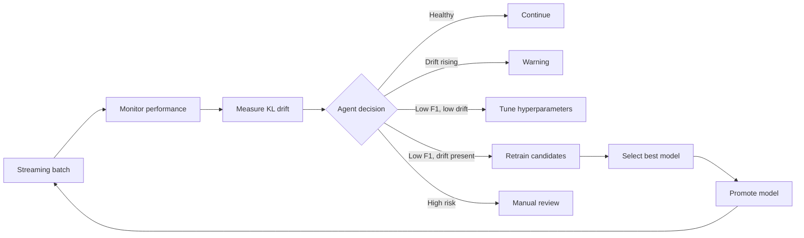
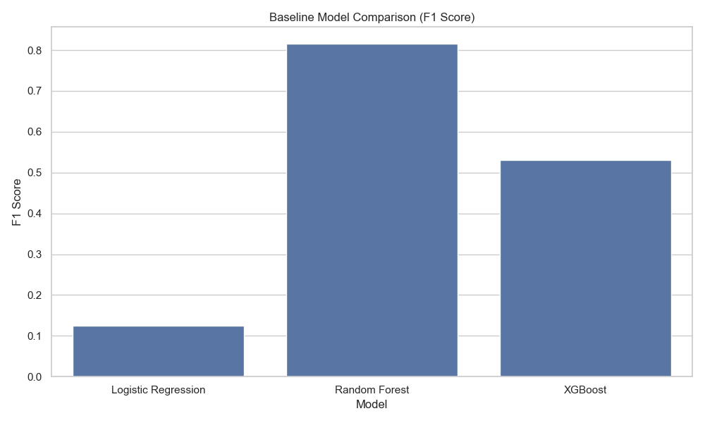
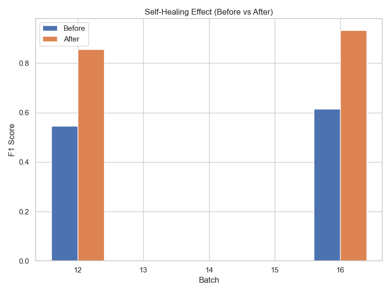
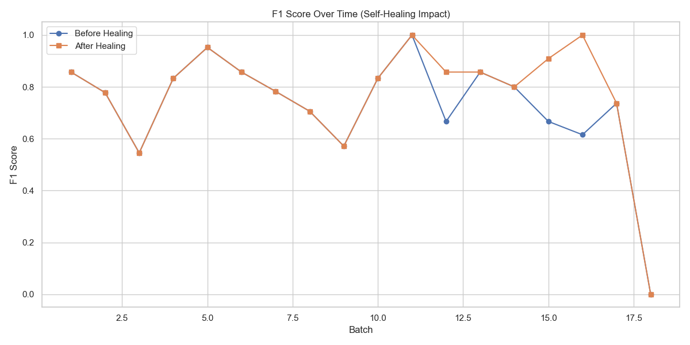
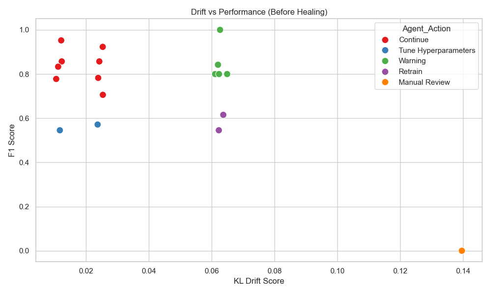
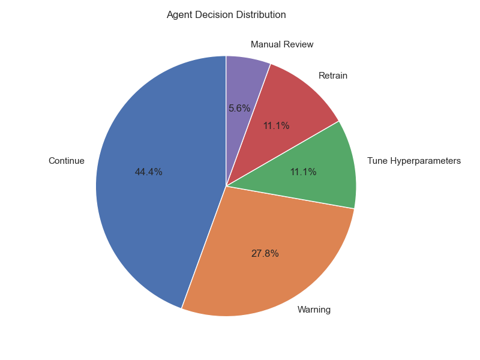

<div align="center">



# Self-Healing ML Pipeline

### Autonomous model monitoring, drift detection, and retraining for production ML systems

<p align="center">
  <a href="#quick-start">Quick Start</a>
  &nbsp;|&nbsp;
  <a href="#research-story">Research Story</a>
  &nbsp;|&nbsp;
  <a href="#architecture">Architecture</a>
  &nbsp;|&nbsp;
  <a href="#key-results">Key Results</a>
  &nbsp;|&nbsp;
  <a href="#visual-evidence">Visual Evidence</a>
  &nbsp;|&nbsp;
  <a href="#contributors">Contributors</a>
</p>

<p align="center">
  <a href="https://python.org"></a>
  <a href="https://scikit-learn.org"></a>
  <a href="https://xgboost.readthedocs.io"></a>
  <a href="https://pandas.pydata.org"></a>
  <a href="https://www.kaggle.com/datasets/mlg-ulb/creditcardfraud"></a>
</p>

</div>

---

## Research Story

<p align="justify">
Machine learning models rarely fail with a dramatic crash. More often, they fade quietly. A model that performed well during validation can begin to lose precision, miss emerging fraud patterns, or react poorly to shifted transaction behavior. In high-stakes domains such as financial fraud detection, that silent degradation is expensive: missed anomalies, delayed interventions, unnecessary alerts, and a growing gap between the model's training assumptions and the world it now faces.
</p>

<p align="justify">
This project turns that problem into a closed-loop operating system for machine learning. Instead of waiting for a scheduled retraining cycle or a human analyst to notice performance decay, the pipeline continuously watches streaming batches, measures performance and drift, decides what kind of response is needed, retrains candidate models when necessary, and promotes the strongest candidate back into production.
</p>

<p align="justify">
The result is a compact, reproducible framework for <strong>self-healing machine learning</strong>: a pipeline that can detect when it is drifting away from reliable behavior and take corrective action before degradation becomes permanent.
</p>

> **Paper:** Self-Healing Machine Learning Pipelines Using Agentic AI: A Framework for Autonomous Model Monitoring and Retraining<br>
> **Authors:** Mohammad Nasim, Harika Yenuga, and Itauma Itauma<br>
> **Venue:** International Business Analytics Conference for Academic and Industry Professionals (IBAC), Vol. 01, Issue 01, May 2026

---

## At a Glance

<table>
  <tr>
    <td width="25%" align="center"><strong>Dataset</strong><br><br>284,807 credit card transactions<br>0.17% fraud class</td>
    <td width="25%" align="center"><strong>Stream Test</strong><br><br>18 sequential batches<br>5,000 transactions each</td>
    <td width="25%" align="center"><strong>Best Baseline</strong><br><br>Random Forest<br>F1 = 0.8157</td>
    <td width="25%" align="center"><strong>Healing Rate</strong><br><br>3 / 3 successful retraining events<br>100% recovery success</td>
  </tr>
</table>

---

## Interactive Map

Open the sections that match what you want to inspect.

<details open>
<summary><strong>1. What this pipeline does</strong></summary>

The pipeline behaves like an autonomous monitoring and recovery layer around a fraud detection model. It receives new data in batches, evaluates whether the current production model is still reliable, checks whether feature distributions are drifting, and chooses an action.

```text
New batch arrives
    -> evaluate model performance
    -> measure distribution drift
    -> decide operational action
    -> retrain when needed
    -> promote the best candidate
```

</details>

<details>
<summary><strong>2. Why agentic AI appears here</strong></summary>

The controller is agentic because it does not simply report metrics. It interprets monitoring signals and maps them to actions: continue, warn, tune, retrain, or escalate for manual review. In this implementation, the agent policy is deterministic and auditable, which makes the research workflow easier to reproduce.

</details>

<details>
<summary><strong>3. Why fraud detection is a hard test case</strong></summary>

Fraud detection is imbalanced, noisy, and distribution-sensitive. A model can look strong on accuracy while still missing important minority-class events. That is why this project emphasizes F1-score, recall, ROC-AUC, and drift signals rather than relying on accuracy alone.

</details>

---

## Architecture

<p align="justify">
The architecture is organized as a feedback loop. Each batch is evaluated, the controller decides whether the system is still healthy, and the retraining engine repairs the pipeline when severe drift damages model performance.
</p>


### System Components

| Layer | Role | Output |
|:--|:--|:--|
| Streaming batch simulator | Creates sequential production-like batches and injects controlled drift | Stable, moderate, and severe drift phases |
| Monitoring module | Measures F1-score, recall, ROC-AUC, and KL divergence | Batch-level health profile |
| Agentic decision controller | Converts health signals into an action | Continue, warning, tune, retrain, or manual review |
| Retraining engine | Trains and evaluates candidate models | Best replacement model |
| Model registry and deployment step | Promotes the winning model | Updated production model and feedback loop |

### Pipeline Timeline



---

## Key Results

<p align="justify">
The experiment produces three takeaways: Random Forest is the strongest initial production model, severe drift causes measurable performance decay, and the self-healing loop restores F1-score after autonomous retraining. The visual summary below is designed for quick scanning; detailed metrics are available only in the expandable sections.
</p>



<p align="center">
  
  
</p>

<p align="justify">
Random Forest was selected as the initial production model because it achieved the strongest F1-score on a highly imbalanced fraud detection task. During severe drift, the agent triggered retraining three times. Each intervention improved F1-score, with the strongest recovery occurring in batch 16.
</p>

<details>
<summary><strong>Baseline model comparison</strong></summary>

Three candidate models were trained on 199,364 transactions and evaluated on 85,443 holdout transactions.

- **Logistic Regression:** Accuracy 97.86%, Precision 0.0670, Recall 0.8784, F1 0.1245, ROC-AUC 0.9680.
- **Random Forest:** Accuracy 99.94%, Precision 0.9720, Recall 0.7027, F1 0.8157, ROC-AUC 0.9275. Selected as the production baseline.
- **XGBoost:** Accuracy 99.74%, Precision 0.3853, Recall 0.8514, F1 0.5305, ROC-AUC 0.9732.

</details>

<details>
<summary><strong>Self-healing impact</strong></summary>

- Average F1 before healing: `0.7255`
- Average F1 after healing: `0.7709`
- Net F1 improvement: `+0.0454`
- Retraining events triggered: `3`
- Successful healing events: `3 / 3`

</details>

<details>
<summary><strong>Recovery events</strong></summary>

- **Batch 12:** severe drift, F1 improved from `0.6667` to `0.8571` for a `+28.6%` recovery.
- **Batch 15:** severe drift, F1 improved from `0.6667` to `0.9091` for a `+36.4%` recovery.
- **Batch 16:** severe drift, F1 improved from `0.6154` to `1.0000` for a `+62.5%` recovery.

</details>

<details>
<summary><strong>Agent decision distribution</strong></summary>

- Continue: `8` batches, `44.4%`
- Warning: `4` batches, `22.2%`
- Retrain: `3` batches, `16.7%`
- Tune Hyperparameters: `2` batches, `11.1%`
- Manual Review: `1` batch, `5.6%`

</details>

---

## Visual Evidence

<p align="justify">
The repository includes generated figures for the main experimental outputs. These charts are useful when presenting the work because they show the full story: baseline selection, performance degradation, drift pressure, agent behavior, and recovery after retraining.
</p>

<p align="center">
  
  
  
</p>

<p align="center">
  
  
</p>

<details>
<summary><strong>What each figure shows</strong></summary>

- **Baseline F1 comparison:** Random Forest provides the strongest F1-score among the evaluated models.
- **F1 trend:** The production model is tracked across streaming batches and healing points.
- **Drift vs. F1:** KL divergence is compared against model performance decay.
- **Agent distribution:** The controller's continue, warning, tune, retrain, and manual review actions are summarized.
- **Self-healing effect:** Before-and-after F1 recovery is shown for retraining events.

</details>

---

## Agent Decision Engine

The agent converts two monitoring signals into operational behavior:

| Performance / Drift State | KL < 0.05 | 0.05 <= KL < 0.10 | KL >= 0.10 |
|:--|:--|:--|:--|
| F1 >= 0.70 | Continue | Warning | Manual Review |
| F1 < 0.70 | Tune Hyperparameters | Retrain | Manual Review |

<details>
<summary><strong>Retraining sequence</strong></summary>

When retraining is triggered, the pipeline:

1. Appends the drifted batch to the dynamic training pool.
2. Trains Logistic Regression, Random Forest, and XGBoost candidates.
3. Evaluates each candidate on a held-out 20% validation split.
4. Promotes the best candidate back into production.
5. Continues monitoring future batches using the updated model.

</details>

---

## Quick Start

### 1. Clone and create an environment

```bash
git clone https://github.com/yenugah80/Self-Healing-ML-Pipeline.git
cd Self-Healing-ML-Pipeline
python -m venv .venv
```

### 2. Activate the environment

```bash
# Windows
.venv\Scripts\activate

# macOS/Linux
source .venv/bin/activate
```

### 3. Install dependencies

```bash
pip install -r requirements.txt
```

### 4. Add the dataset

Download the Kaggle [Credit Card Fraud Detection](https://www.kaggle.com/datasets/mlg-ulb/creditcardfraud) dataset and place `creditcard.csv` in the project root.

```bash
# Kaggle CLI option
kaggle datasets download -d mlg-ulb/creditcardfraud --unzip
```

### 5. Run the full experiment

```bash
python step1_baseline_experiment.py
python step2_drift_monitoring.py
python step3_agentic_decision_controller.py
python step4_self_healing_retraining.py
python step5_results_visualization.py
```

---

## Experiment Design

### Drift Simulation

The test set is split into 18 sequential batches of 5,000 transactions. Gaussian noise is injected into the following features:

```text
V1, V2, V3, V4, V10, V11, V12, V14, Amount
```

| Phase | Batches | Drift Strength | Noise Distribution | Expected Behavior |
|:--|:--:|:--:|:--:|:--|
| Stable | 1-5 | `0.0` | None | Baseline behavior remains steady |
| Moderate drift | 6-10 | `0.3` | `N(0.3, 0.3)` | Drift rises while F1 mostly holds |
| Severe drift | 11-18 | `0.7` | `N(0.7, 0.7)` | Drift damages F1 and healing is triggered |

### Generated Outputs

| Stage | Script | Output |
|:--|:--|:--|
| Baseline modeling | `step1_baseline_experiment.py` | `step1_baseline_results.csv` |
| Drift monitoring | `step2_drift_monitoring.py` | `step2_drift_monitoring_results.csv` |
| Agent decisions | `step3_agentic_decision_controller.py` | `step3_agentic_decision_results.csv` |
| Self-healing retraining | `step4_self_healing_retraining.py` | `step4_self_healing_results.csv`, `step4_candidate_model_log.csv` |
| Visualization | `step5_results_visualization.py` | `chart1_baseline_f1.png` through `chart5_self_healing.png` |

---

## Project Structure

```text
Self-Healing-ML-Pipeline/
|
|-- step1_baseline_experiment.py
|-- step2_drift_monitoring.py
|-- step3_agentic_decision_controller.py
|-- step4_self_healing_retraining.py
|-- step5_results_visualization.py
|
|-- step1_baseline_results.csv
|-- step2_drift_monitoring_results.csv
|-- step3_agentic_decision_results.csv
|-- step4_candidate_model_log.csv
|-- step4_self_healing_results.csv
|
|-- architecture.png
|-- chart1_baseline_f1.png
|-- chart2_f1_trend.png
|-- chart3_drift_vs_f1.png
|-- chart4_agent_distribution.png
|-- chart5_self_healing.png
|
|-- requirements.txt
`-- README.md
```

---

## Contributors

| Contributor | GitHub | Role |
|:--|:--|:--|
| **Harika Yenuga** | [@yenugah80](https://github.com/yenugah80) | Repository owner and project contributor |

---

## Paper Authors

| Author | Affiliation / Focus |
|:--|:--|
| **Mohammad Nasim** | Senior AI Solution Architect; Ph.D. Computer Science; Adjunct Faculty, Northwood University; Agentic AI, RAG, and multi-agent orchestration |
| **Harika Yenuga** | AI/ML Engineer; M.S. Business Analytics, Northwood University; finance, retail, and enterprise ML systems |
| **Itauma Itauma** | Analytics Professor, Northwood University; data science, AI, and education |

---

## Future Work

| Direction | Description |
|:--|:--|
| LLM-driven controller | Replace the deterministic action policy with an LLM-based decision layer that reasons over historical context. |
| Real-time streaming | Move from batch simulation to Kafka or Spark Streaming ingestion. |
| Advanced drift detection | Add multivariate, embedding-based, and autoencoder-based drift detectors. |
| Explainability | Integrate SHAP or LIME to explain retraining and escalation decisions. |
| Cross-domain validation | Evaluate the same framework on cybersecurity, healthcare, and IoT anomaly detection. |
| Reinforcement learning | Train an agent to minimize cumulative performance degradation over time. |

---

## Citation

If you use this code or framework in your research, please cite:

```bibtex
@inproceedings{nasim2026selfhealing,
  title     = {Self-Healing Machine Learning Pipelines Using Agentic AI:
               A Framework for Autonomous Model Monitoring and Retraining},
  author    = {Nasim, Mohammad and Yenuga, Harika and Itauma, Itauma},
  booktitle = {International Business Analytics Conference for Academic and
               Industry Professionals (IBAC)},
  volume    = {1},
  number    = {1},
  year      = {2026},
  address   = {Midland, MI, USA}
}
```

---

<div align="center">

<strong>Self-healing ML is not just retraining. It is monitoring, reasoning, recovery, and accountability in one loop.</strong>

<br><br>

Copyright 2026 Mohammad Nasim, Harika Yenuga, and Itauma Itauma.

</div>
