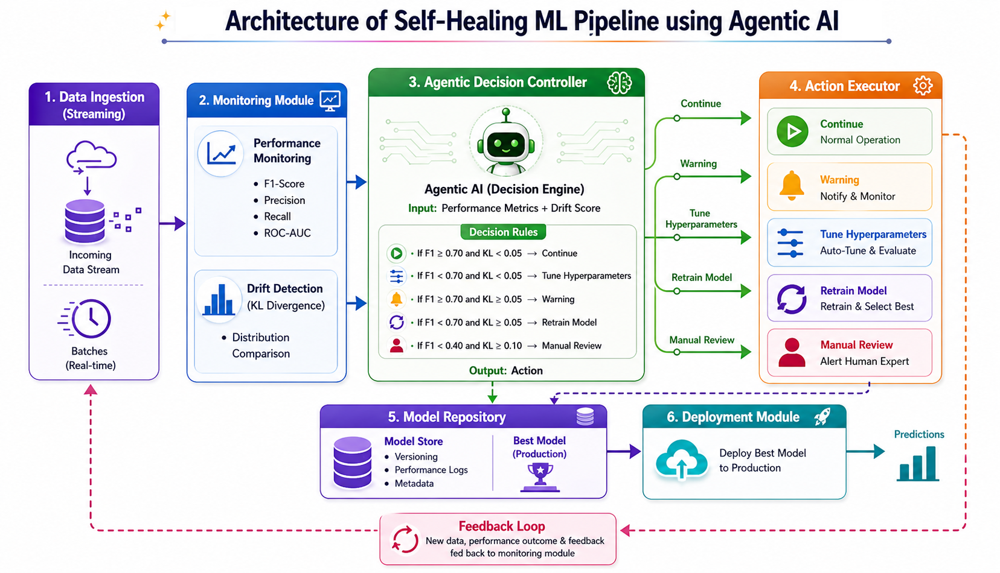

<div align="center">



# Self-Healing ML Pipeline

### Autonomous Model Monitoring, Drift Detection, and Retraining with Agentic AI

[](https://python.org)
[](https://scikit-learn.org)
[](https://xgboost.readthedocs.io)
[](https://pandas.pydata.org)

[](#citation)
[](https://www.kaggle.com/datasets/mlg-ulb/creditcardfraud)
[](LICENSE)
[](#)

[](#key-results)
[](#key-results)
[](#self-healing-impact)
[](#self-healing-impact)

</div>

> **Self-Healing Machine Learning Pipelines Using Agentic AI: A Framework for Autonomous Model Monitoring and Retraining**<br>
> Mohammad Nasim, Harika Yenuga, and Itauma Itauma<br>
> International Business Analytics Conference for Academic and Industry Professionals (IBAC), Vol. 01, Issue 01, May 2026

---

## Table of Contents

| Section | Description |
|:--|:--|
| [Overview](#overview) | Project purpose, problem context, and workflow summary |
| [Architecture](#architecture) | End-to-end pipeline design and system components |
| [Key Results](#key-results) | Baseline metrics, healing impact, and agent decisions |
| [Agent Decision Engine](#agent-decision-engine) | Rule-based action policy for drift and performance events |
| [Quick Start](#quick-start) | Installation, dataset setup, and execution commands |
| [Drift Simulation](#drift-simulation) | Streaming batch setup and drift injection strategy |
| [Project Structure](#project-structure) | Repository layout and generated artifacts |
| [Contributors](#contributors) | Repository contributor information |
| [Paper Authors](#paper-authors) | Research paper author information |
| [Future Work](#future-work) | Planned extensions and research directions |
| [Citation](#citation) | BibTeX citation |

---

## Overview

Production machine learning models can degrade silently as real-world data begins to differ from the data used during training. In fraud detection, this problem is especially important because transaction behavior and fraud patterns change over time, while the positive class remains extremely rare.

This project implements a closed-loop, self-healing ML pipeline that monitors model performance, detects data drift, decides whether intervention is needed, retrains candidate models, and promotes the best-performing model without manual intervention.

### Pipeline Workflow

```text
Streaming transaction batches
        |
        v
Performance and drift monitoring
        |
        v
Agentic decision controller
        |
        +--> Continue
        +--> Warning
        +--> Tune hyperparameters
        +--> Retrain
        +--> Manual review
        |
        v
Autonomous retraining and candidate model selection
        |
        v
Model promotion and feedback loop
```

The pipeline is evaluated on the [Credit Card Fraud Detection](https://www.kaggle.com/datasets/mlg-ulb/creditcardfraud) dataset, which contains 284,807 transactions with a 0.17% positive fraud class. Evaluation is performed across 18 simulated streaming batches with stable, moderate-drift, and severe-drift phases.

---

## Architecture

The system is organized into five core modules:

| Module | Responsibility |
|:--|:--|
| Streaming batch simulator | Splits test data into sequential batches and injects controlled drift |
| Monitoring module | Computes F1-score, recall, ROC-AUC, and KL divergence for each batch |
| Agentic controller | Converts monitoring signals into operational decisions |
| Retraining engine | Trains Logistic Regression, Random Forest, and XGBoost candidates when healing is triggered |
| Model registry and deployment module | Promotes the best candidate model back into production |

### System Flow

```text
                 Self-Healing ML Pipeline

   +----------------+      +----------------+      +----------------------+
   | Streaming      | ---> | Monitoring     | ---> | Agentic Controller   |
   | Batches        |      | Module         |      | Rule-Based Policy    |
   +----------------+      +----------------+      +----------+-----------+
                                                             |
                                                             v
   +----------------+      +----------------+      +----------------------+
   | Deployment     | <--- | Model Registry | <--- | Retraining Engine    |
   | Module         |      |                |      | Candidate Selection  |
   +-------+--------+      +----------------+      +----------------------+
           |
           +------------------------ feedback loop ------------------------+
```

The architecture image at the top of this README provides the paper-style visual representation of this workflow.

---

## Key Results

### Baseline Results

Three baseline models were trained on 199,364 transactions and evaluated on 85,443 holdout transactions.

| Model | Accuracy | Precision | Recall | F1-Score | ROC-AUC |
|:--|:--:|:--:|:--:|:--:|:--:|
| Logistic Regression | 97.86% | 0.0670 | 0.8784 | 0.1245 | 0.9680 |
| **Random Forest** | **99.94%** | **0.9720** | **0.7027** | **0.8157** | 0.9275 |
| XGBoost | 99.74% | 0.3853 | 0.8514 | 0.5305 | **0.9732** |

Random Forest was selected as the initial production model because it achieved the strongest F1-score on the highly imbalanced fraud detection task.

### Self-Healing Impact

The self-healing pipeline ran across 18 streaming batches and triggered autonomous retraining during severe drift.

| Metric | Value |
|:--|:--:|
| Average F1 before healing | `0.7255` |
| Average F1 after healing | `0.7709` |
| Net F1 improvement | **`+0.0454`** |
| Retraining events triggered | **3** batches: 12, 15, 16 |
| Self-healing success rate | **100%** |

### Per-Healing Event Breakdown

| Batch | Drift Strength | F1 Before | F1 After | Recovery |
|:--:|:--:|:--:|:--:|:--:|
| 12 | 0.7 severe | 0.6667 | 0.8571 | **+28.6%** |
| 15 | 0.7 severe | 0.6667 | 0.9091 | **+36.4%** |
| 16 | 0.7 severe | 0.6154 | **1.0000** | **+62.5%** |

### Agent Decision Distribution

| Action | Count | Share |
|:--|:--:|:--:|
| Continue | 8 | 44.4% |
| Warning | 4 | 22.2% |
| Retrain | 3 | 16.7% |
| Tune Hyperparameters | 2 | 11.1% |
| Manual Review | 1 | 5.6% |

---

## Agent Decision Engine

The agentic controller maps each `(F1-score, KL-divergence)` pair to one of five operational actions.

| Performance / Drift State | KL < 0.05 | 0.05 <= KL < 0.10 | KL >= 0.10 |
|:--|:--|:--|:--|
| F1 >= 0.70 | Continue | Warning | Manual Review |
| F1 < 0.70 | Tune Hyperparameters | Retrain | Manual Review |

When `Retrain` is triggered, the retraining engine:

1. Appends the drifted batch to the dynamic training pool.
2. Trains Logistic Regression, Random Forest, and XGBoost candidates.
3. Evaluates candidates on a held-out 20% validation split.
4. Promotes the best candidate model back to production.

---

## Quick Start

### Prerequisites

```bash
git clone https://github.com/yenugah80/Self_Healing_ML_Pipeline.git
cd Self_Healing_ML_Pipeline
python -m venv .venv
```

Activate the virtual environment:

```bash
# Windows
.venv\Scripts\activate

# macOS/Linux
source .venv/bin/activate
```

Install dependencies:

```bash
pip install -r requirements.txt
```

### Dataset Setup

The pipeline uses the Kaggle [Credit Card Fraud Detection](https://www.kaggle.com/datasets/mlg-ulb/creditcardfraud) dataset. The dataset is approximately 144 MB and is not committed to this repository.

```bash
# Option A: Kaggle CLI
kaggle datasets download -d mlg-ulb/creditcardfraud --unzip

# Option B: Manual download
# Download creditcard.csv from Kaggle and place it in the project root.
```

### Run the Pipeline

```bash
python step1_baseline_experiment.py
python step2_drift_monitoring.py
python step3_agentic_decision_controller.py
python step4_self_healing_retraining.py
python step5_results_visualization.py
```

### Generated Outputs

| Step | Output |
|:--|:--|
| Step 1 | `step1_baseline_results.csv` |
| Step 2 | `step2_drift_monitoring_results.csv` |
| Step 3 | `step3_agentic_decision_results.csv` |
| Step 4 | `step4_self_healing_results.csv`, `step4_candidate_model_log.csv` |
| Step 5 | `chart1_baseline_f1.png` through `chart5_self_healing.png` |

Steps 1, 2, and 4 may take several minutes depending on hardware. Step 5 is typically near-instant.

---

## Drift Simulation

The test set is split into 18 sequential batches of 5,000 transactions. Gaussian noise is injected into the following features:

```text
V1, V2, V3, V4, V10, V11, V12, V14, Amount
```

| Phase | Batches | Drift Strength | Noise Distribution | Expected Behavior |
|:--|:--:|:--:|:--:|:--|
| Stable | 1-5 | `0.0` | None | Baseline performance remains steady |
| Moderate drift | 6-10 | `0.3` | `N(0.3, 0.3)` | KL divergence rises while F1 mostly holds |
| Severe drift | 11-18 | `0.7` | `N(0.7, 0.7)` | KL divergence exceeds threshold and self-healing triggers |

---

## Project Structure

```text
Self_Healing_ML_Pipeline/
|
|-- step1_baseline_experiment.py          # Train Logistic Regression, Random Forest, and XGBoost baselines
|-- step2_drift_monitoring.py             # Simulate streaming batches and compute drift metrics
|-- step3_agentic_decision_controller.py  # Apply the rule-based agent policy
|-- step4_self_healing_retraining.py      # Trigger retraining and model selection
|-- step5_results_visualization.py        # Generate result visualizations
|
|-- step1_baseline_results.csv
|-- step2_drift_monitoring_results.csv
|-- step3_agentic_decision_results.csv
|-- step4_candidate_model_log.csv
|-- step4_self_healing_results.csv
|
|-- architecture.png
|-- chart1_baseline_f1.png
|-- chart2_f1_trend.png
|-- chart3_drift_vs_f1.png
|-- chart4_agent_distribution.png
|-- chart5_self_healing.png
|
|-- requirements.txt
`-- README.md
```

---

## Contributors

| Contributor | GitHub | Role |
|:--|:--|:--|
| **Harika Yenuga** | [@yenugah80](https://github.com/yenugah80) | Repository owner and project contributor |

---

## Paper Authors

| Author | Affiliation / Focus |
|:--|:--|
| **Mohammad Nasim** | Senior AI Solution Architect; Ph.D. Computer Science; Adjunct Faculty, Northwood University; Agentic AI, RAG, and multi-agent orchestration |
| **Harika Yenuga** | AI/ML Engineer; M.S. Business Analytics, Northwood University; finance, retail, and enterprise ML systems |
| **Itauma Itauma** | Analytics Professor, Northwood University; data science, AI, and education |

---

## Future Work

| Direction | Description |
|:--|:--|
| LLM-driven agent | Replace the deterministic controller with an LLM-based policy that reasons over context and history |
| Real-time streaming | Move from batch simulation to Kafka or Spark Streaming ingestion |
| Advanced drift detection | Add multivariate, embedding-based, or autoencoder-based drift detectors |
| Explainability | Integrate SHAP or LIME for retraining and escalation decisions |
| Cross-domain validation | Evaluate the framework on cybersecurity, healthcare, and IoT anomaly detection tasks |
| Reinforcement learning | Train an agent to minimize cumulative performance degradation over time |

---

## Citation

If you use this code or framework in your research, please cite:

```bibtex
@inproceedings{nasim2026selfhealing,
  title     = {Self-Healing Machine Learning Pipelines Using Agentic AI:
               A Framework for Autonomous Model Monitoring and Retraining},
  author    = {Nasim, Mohammad and Yenuga, Harika and Itauma, Itauma},
  booktitle = {International Business Analytics Conference for Academic and
               Industry Professionals (IBAC)},
  volume    = {1},
  number    = {1},
  year      = {2026},
  address   = {Midland, MI, USA}
}
```

---

<div align="center">

[](https://python.org)
[](https://northwood.edu)
[](https://ibacconference.com)

Copyright 2026 Mohammad Nasim, Harika Yenuga, and Itauma Itauma.

</div>
